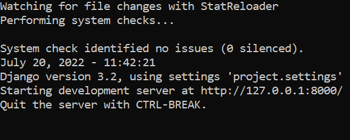

# Пульт охраны банка

Используя этот пульт-сайт, охранник банка 😎 сможет видеть посещения хранилища, все активные карты доступа и их владельцев.

## Как установить

Python3 должен быть уже установлен. Если вас его нет, то следуйте рекомендациям [статьи по установке Python для Windows](https://docs.microsoft.com/ru-ru/windows/python/beginners#install-python).
Затем используйте `pip` для установки зависимостей:
```
pip install -r requirements.txt
```

## Подготовка файла .env

В папке проекта создайте файл `.env`. Заполните переменные `HOST`, `PORT`, `NAME`, `USER`, `PASSWORD`.

Выглядеть должно примерно так:
```
DB_HOST='bank.security.host'
DB_PORT=12345
DB_NAME='bank'
DB_USER='security'
DB_PASSWORD='123abc'
```

## Запуск

Для запуска используйте команду в папке проекта:
```
python main.py
```
Вы увидите сообщение о том, что сервер запущен.




## Цель проекта

Код написан в образовательных целях на онлайн-курсе для веб-разработчиков [dvmn.org](https://dvmn.org/).
